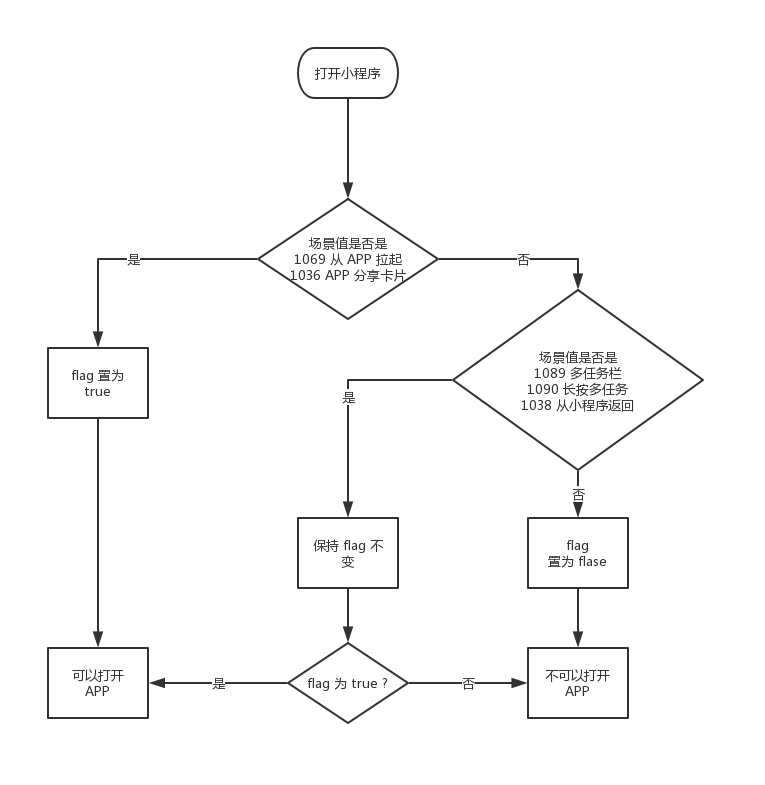

# 支付宝APP跳转小程序支付
采用schema 方式进行跳转

# 微信APP跳转小程序支付

参考地址：https://developers.weixin.qq.com/doc/oplatform/Mobile_App/Launching_a_Mini_Program/Launching_a_Mini_Program.html
```
移动应用拉起小程序是指用户可以通过接入该功能的第三方移动应用（APP）跳转至某一微信小程序的指定页面，完成服务后跳回至原移动应用（APP）。
移动应用拉起小程序功能已向全体开发者开放，开发者在微信开放平台帐号下申请移动应用并通过审核后，即可获得移动应用拉起小程序功能权限。
可在**“管理中心-移动应用-应用详情-关联小程序信息”**，为通过审核的移动应用发起关联小程序操作。
在同一开放平台账号下的移动应用及小程序无需关联即可完成跳转，非同一开放平台账号下的小程序需与移动应用（APP）成功关联后才支持跳转。
一个移动应用只能最多同时绑定3个小程序，每月支持绑定3次。同一个小程序可被500个移动应用关联。
# Android 开发示例
开发前需下载Android开发工具包（SDK），可在**“资源中心-开发资源-资源下载-Android资源下载”**按照指引操作。
调用接口：WXLaunchMiniProgram 移动应用跳转到小程序示例：
String appId = "wxd930ea5d5a258f4f"; // 填应用AppId
IWXAPI api = WXAPIFactory.createWXAPI(context, appId);

WXLaunchMiniProgram.Req req = new WXLaunchMiniProgram.Req();
req.userName = "gh_d43f693ca31f"; // 填小程序原始id
req.path = path;                  ////拉起小程序页面的可带参路径，不填默认拉起小程序首页，对于小游戏，可以只传入 query 部分，来实现传参效果，如：传入 "?foo=bar"。
req.miniprogramType = WXLaunchMiniProgram.Req.MINIPTOGRAM_TYPE_RELEASE;// 可选打开 开发版，体验版和正式版
api.sendReq(req);
回调说明
WXEntryActivity中
public void onResp(BaseResp resp) {
    if (resp.getType() == ConstantsAPI.COMMAND_LAUNCH_WX_MINIPROGRAM) {
        WXLaunchMiniProgram.Resp launchMiniProResp = (WXLaunchMiniProgram.Resp) resp;
        String extraData =launchMiniProResp.extMsg; //对应小程序组件 <button open-type="launchApp"> 中的 app-parameter 属性
    }
}
详细demo请参考官网上的Sample工程。
```
小程序跳转回移动应用请参考<a href="https://developers.weixin.qq.com/miniprogram/dev/api/launchApp.html"target="_blank">《小程序开发文档》

# IOS 开发示例

```
开发前需下载iOS开发工具包（SDK），可在**“资源中心-开发资源-资源下载-iOS资源下载”**按照指引操作。
移动应用跳转到小程序示例：
WXLaunchMiniProgramReq *launchMiniProgramReq = [WXLaunchMiniProgramReq object];
launchMiniProgramReq.userName = userName;  //拉起的小程序的username
launchMiniProgramReq.path = path;    ////拉起小程序页面的可带参路径，不填默认拉起小程序首页，对于小游戏，可以只传入 query 部分，来实现传参效果，如：传入 "?foo=bar"。
launchMiniProgramReq.miniProgramType = miniProgramType; //拉起小程序的类型
return  [WXApi sendReq:launchMiniProgramReq];
回调说明
-(void)onResp:(BaseResp *)resp 
{
     if ([resp isKindOfClass:[WXLaunchMiniProgramResp class]])
     {
          NSString *string = resp.extMsg;
          // 对应JsApi navigateBackApplication中的extraData字段数据
     }
}
```
小程序跳转回移动应用请参考<a href="https://developers.weixin.qq.com/miniprogram/dev/api/launchApp.html"target="_blank">《小程序开发文档》
    
# 小程序打开App


https://developers.weixin.qq.com/miniprogram/dev/framework/open-ability/launchApp.html

打开 App

此功能需要用户主动触发才能打开 APP，所以不由 API 来调用，需要用 open-type 的值设置为 launchApp 的 button 组件的点击来触发。

当小程序从 APP 分享消息卡片的场景打开（场景值 1036，APP 分享小程序文档 iOS / Android） 或从 APP 打开的场景打开时（场景值 1069），小程序会获得打开 APP 的能力，此时用户点击按钮可以打开分享该小程序卡片/拉起该小程序的 APP。即小程序不能打开任意 APP，只能 跳回 APP。

在一个小程序的生命周期内，只有在特定条件下，才具有打开 APP 的能力。

在基础库 < 2.5.1 的版本，这个能力的规则如下：

当小程序从 1069 场景打开时，可以打开 APP。

当小程序从非 1069 的打开时，会在小程序框架内部会管理的一个状态，为 true 则可以打开 APP，为 false 则不可以打开 APP。这个状态的维护遵循以下规则：

当小程序从 App 分享消息卡片（场景值1036）打开时，该状态置为 true。
当小程序从以下场景打开时，保持上一次打开小程序时打开 App 能力的状态：
从其他小程序返回小程序（场景值1038）时（基础库 2.2.4 及以上版本支持）
小程序从聊天顶部场景（场景值1089）中的「最近使用」内打开时
长按小程序右上角菜单唤出最近使用历史（场景值1090）打开时
当小程序从非以上场景打开时，不具有打开 APP 的能力，该状态置为 false。


图一

在基础库 >= 2.5.1 时，这个能力的规则如下：

当小程序从任意场景打开时，会在小程序框架内部会管理的一个状态，为 true 则可以打开 APP，为 false 则不可以打开 APP。这个状态的维护遵循以下规则：

当小程序从 App 分享消息卡片（场景值1036）或从 APP 打开的场景打开时（场景值 1069）打开时，该状态置为 true。
当小程序从以下场景打开时，保持上一次打开小程序时打开 App 能力的状态：
从其他小程序返回小程序（场景值1038）时（基础库 2.2.4 及以上版本支持）
小程序从聊天顶部场景（场景值1089）中的「最近使用」内打开时
长按小程序右上角菜单唤出最近使用历史（场景值1090）打开时
当小程序从非以上场景打开时，不具有打开 APP 的能力，该状态置为 false。


图二


使用方法

小程序端

需要将 button 组件 open-type 的值设置为 launchApp。如果需要在打开 APP 时向 APP 传递参数，可以设置 app-parameter 为要传递的参数。通过 binderror 可以监听打开 APP 的错误事件。

app 端

APP 需要接入 OpenSDK。 文档请参考 iOS / Android

Android 第三方 app 需要处理 ShowMessageFromWX.req 的微信回调，iOS 则需要将 appId 添加到第三方 app 工程所属的 plist 文件 URL types 字段。 app-parameter 的获取方法，请参考 Android SDKSample 中 WXEntryActivity 中的 onResp 方法以及 iOS SDKSample 中 WXApiDelegate 中的 onResp 方法。

代码示例

<button open-type="launchApp" app-parameter="wechat" binderror="launchAppError">打开APP</button>
Page({
  launchAppError (e) {
    console.log(e.detail.errMsg)
  }
})
error 事件参数说明

值	说明
invalid scene	调用场景不正确，即此时的小程序不具备打开 APP 的能力。
