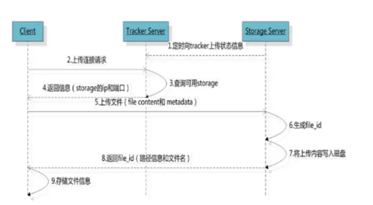

1.fastDFS介绍：

fastDFS 是以C语言开发的一项开源轻量级分布式文件系统，他对文件进行管理，主要功能有：文件存储，文件同步，文件访问（文件上传/下载）,特别适合以文件为载体的在线服务，如图片网站，视频网站等

分布式文件系统：
基于客户端/服务器的文件存储系统
对等特性允许一些系统扮演客户端和服务器的双重角色，可供多个用户访问的服务器，比如，用户可以“发表”一个允许其他客户机访问的目录，一旦被访问，这个目录对客户机来说就像使用本地驱动器一样
FastDFS由跟踪服务器(Tracker Server)、存储服务器(Storage Server)和客户端(Client)构成。

Tracker server 追踪服务器

追踪服务器负责接收客户端的请求，选择合适的组合storage server ，tracker server 与 storage server之间也会用心跳机制来检测对方是否活着。
Tracker需要管理的信息也都放在内存中，并且里面所有的Tracker都是对等的（每个节点地位相等），很容易扩展
客户端访问集群的时候会随机分配一个Tracker来和客户端交互。

Storage server 储存服务器

实际存储数据，分成若干个组（group），实际traker就是管理的storage中的组，而组内机器中则存储数据，group可以隔离不同应用的数据，不同的应用的数据放在不同group里面，

优点：
海量的存储：主从型分布式存储，存储空间方便拓展,
fastDFS对文件内容做hash处理，避免出现重复文件
然后fastDFS结合Nginx集成, 提供网站效率

客户端Client

主要是上传下载数据的服务器，也就是我们自己的项目所部署在的服务器。每个客户端服务器都需要安装Nginx


fastDFS三方交互图
2.读写操作：

写入数据

写操作的时候，storage会将他所挂载的所有数据存储目录的底下都创建2级子目录，每一级256个总共65536个，新写的文件会以hash的方式被路由到其中某个子目录下，然后将文件数据作为本地文件存储到该目录中。



写操作fastDFS流程图

下载文件：

当客户端向Tracker发起下载请求时，并不会直接下载，而是先查询storage server（检测同步状态），返回storage server的ip和端口，
然后客户端会带着文件信息（组名，路径，文件名），去访问相关的storage，然后下载文件。


fastDFS下载文件

使用：

1.首先下载fastdfs安装包和依赖包（sourceforge->fastdfs），然后解压。

配置tracker
 
sudo cp /etc/fdfs/tracker.conf.sample /etc/fdfs/tracker.conf

在/home/python/目录中创建目录 fastdfs/tracker

mkdir –p /home/python/fastdfs/tracker

编辑/etc/fdfs/tracker.conf配置文件

sudo vim /etc/fdfs/tracker.conf

修改 base_path=/home/python/fastdfs/tracker

3.配置storage

sudo cp /etc/fdfs/storage.conf.sample /etc/fdfs/storage.conf

在/home/python/fastdfs/ 目录中创建目录 storage，这个目录就是实际数据存储的位置

mkdir –p /home/python/fastdfs/storage

编辑/etc/fdfs/storage.conf配置文件

sudo vim /etc/fdfs/storage.conf

修改内容：
```
base_path=/home/python/fastdfs/storage
store_path0=/home/python/fastdfs/storage
tracker_server=tracker所在机器的ip:22122
```
启动tracker和storage
```
sudo trackerd /etc/fastdfs/tracker.conf start
sudo storaged /etc/fastdfs/storage.conf start
```
6.测试安装是否成功

sudo cp /etc/fdfs/client.conf.sample /etc/fdfs/client.conf

编辑/etc/fdfs/client.conf配置文件

sudo vim /etc/fdfs/client.conf

修改内容：

base_path=/home/python/fastdfs/tracker
tracker_server=tracker所在机器的ip:22122

上传文件测试：
fdfs_upload_file /etc/fdfs/client.conf filename 

如果返回类似group1/M00/00/00/rBIK6VcaP0aARXDSNFHrUgHEviQ394.jpg的file_id则说明文件上传成功

添加Nginx模块

确保电脑上已经装了Nginx。
下载fastdfs-nginx-module压缩包，并解压
进入Nginx的安装目录
执行
```
sudo ./configure --prefix=/usr/local/nginx/ --add-module=fastdfs-nginx-module解压后目录下src的绝对路径
sudo ./make
sudo ./make install
sudo cp fastdfs-nginx-module解压后目录中src/mod_fastdfs.conf  /etc/fdfs/mod_fastdfs.conf

sudo vim /etc/fdfs/mod_fastdfs.conf
```
修改内容：
```
connect_timeout=10
tracker_server=tracker所在机器的ip:22122
url_have_group_name=true //返回file_id中包含组号
store_path0=/home/python/fastdfs/storage

sudo cp fastdfs-nginx-module目录下http.conf  /etc/fdfs/http.conf

sudo cp 解压缩的fastdfs-nginx-module目录下的mime.types /etc/fdfs/mime.types

sudo vim /usr/local/nginx/conf/nginx.conf
```
在http部分中添加配置信息如下：
``
server {
            listen       8888;
            server_name  localhost;
            location ~/group[0-9]/ { // 地址有组号的，就到下面的位置里找
                ngx_fastdfs_module;
            }
            error_page   500 502 503 504  /50x.html;
            location = /50x.html {
            root   html;
            }
        }
```

Python测试
pip3 install fdfs_client

from fdfs_client import Fdfs_client, get_tracker_conf

conf = get_tracker_conf('/etc/fastdfs/client.conf')
client = Fdfs_client(conf)
client.upload_by_filename('test.jpg')
// 返回file_id则成功
