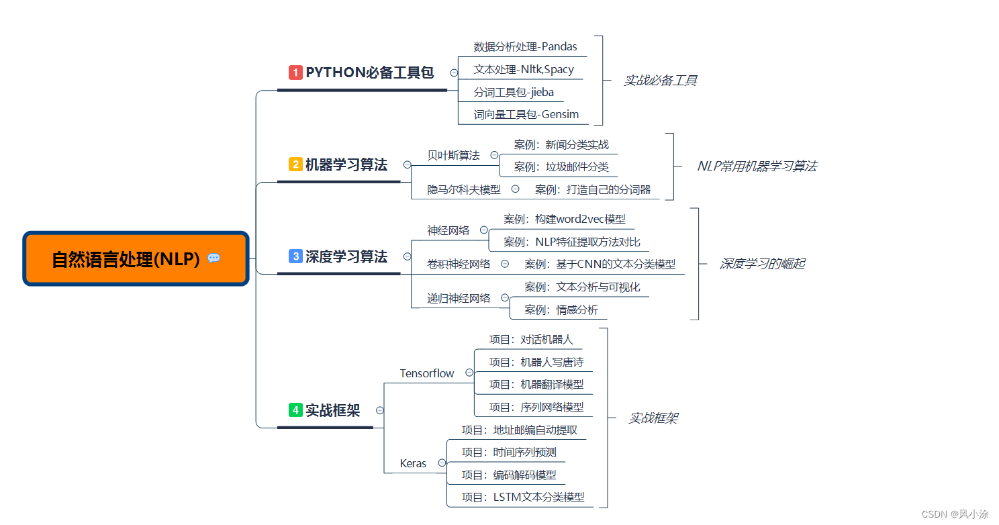

自然语言处理

1. Java自然语言处理 LingPipe
LingPipe是一个自然语言处理的Java开源工具包。LingPipe目前已有很丰富的功能，包括主题分类（Top Classification）、命名实体识别（Named Entity Recognition）、词性标注（Part-of Speech Tagging）、句题检测（Sentence Detection）、查询拼写检查（Query Spell Checking）、兴趣短语检测（Interseting Phrase Detection）、聚类（Clustering）、字符语言建模（Character Language Modeling）、医学文献下载/解析/索引（MEDLINE Download, Parsing and Indexing）、数据库文本挖掘（Database Text Mining）、中文分词（Chinese Word Segmentation）、情感分析（Sentiment Analysis）、语言辨别（Language Identification）等API。

下载链接：http://alias-i.com/lingpipe/web/download.html

2.中文自然语言处理工具包 FudanNLP
FudanNLP主要是为中文自然语言处理而开发的工具包，也包含为实现这些任务的机器学习算法和数据集。

演示地址: http://jkx.fudan.edu.cn/nlp/query

FudanNLP目前实现的内容如下：

中文处理工具
中文分词
词性标注
实体名识别
句法分析
时间表达式识别
信息检索
文 本分类
新闻聚类
Lucene中文分词
机 器学习
Average Perceptron
Passive-aggressive Algorithm
K-means
Exact Inference
下载链接：http://code.google.com/p/fudannlp/downloads/list

 3.自然语言处理工具Apache OpenNLP
OpenNLP 是一个机器学习工具包，用于处理自然语言文本。支持大多数常用的 NLP 任务，例如：标识化、句子切分、部分词性标注、名称抽取、组块、解析等。

下载链接：http://opennlp.apache.org/

 4.自然语言处理工具 CRF++
 CRF++是著名的条件随机场开源工具，也是目前综合性能最佳的CRF工具。CRF++本身已经是个比较老的工具了，但鉴于其性能较好，仍然是自然语言处理很重要的一个工具。

NlpBamboo 中文分词库在使用该工具。

下载链接：http://sourceforge.net/projects/crfpp/files/

 5、Stanford CoreNLP 斯坦福大学NLP
很牛叉的一个库

下载地址 http://search.maven.org/#browse%7C11864822

学习自然语言这一段时间以来接触和听说了好多开源的自然语言处理工具，在这里做一下汇总方便自己以后学习，其中有自己使用过的也有了解不是很多的，对于不甚了解的工具以后学习熟悉了会做更新的。

分词组件
1.IKAnalyzer
IK Analyzer是一个开源的，基于Java语言开发的轻量级的中文分词工具包。从2006.12推出1.0版本开始，IK Analyzer已经推出了多个版本，当前最新版本为2012 u6，最初基于Luence，从3.0开始成为面向Java的公用分词组件，独立于Luence，下载地址为：http://git.oschina.net/wltea/IK-Analyzer-2012FF。IK支持细粒度和智能分词两种切分模式，支持英文字母、数字、中文词汇等分词处理，兼容韩文、日文字符。可以支持用户自定义的词典，IKAnalyzer.cfg.xml文件来实现，可以配置自定义的扩展词典和停用词典。词典需要采用UTF-8无BOM格式编码，并且每个词语占一行。配置文件如下所示：

<properties>    
    <comment>IK Analyzer 扩展配置</comment>  
    <!--用户可以在这里配置自己的扩展字典-->   
    <entry key="ext_dict">ext.dic;</entry>   
      
    <!--用户可以在这里配置自己的扩展停止词字典-->  
    <entry key="ext_stopwords">stopword.dic;chinese_stopword.dic</entry>   
      
</properties>  
IK部署很简单，只需要把IKAnalyzer2012_u6.jar部署于项目的lib中，同时将IKAnalyzer.cfg.xml文件以及词典文件置于src中，即可通过API的方式开发调用。

示例代码：

/** 
     * IK分词功能实现 
     * @return 
     */  
    public String spiltWords(String srcString){  
        StringBuffer wordsBuffer = new StringBuffer("");  
        try{  
            IKSegmenter ik=new IKSegmenter(new StringReader(srcString), true);    
            Lexeme lex=null;    
            while((lex=ik.next())!=null){    
//              System.out.print(lex.getLexemeText()+" ");  
                wordsBuffer.append(lex.getLexemeText()).append(" ");  
            }  
        }catch(Exception e){  
            logger.error(e.getMessage());  
        }  
        return wordsBuffer.toString();  
    }  
IK简单、易于扩展，分词结果较好并且采用Java编写，因为我平时的项目以Java居多，所以是我平时处理分词的首选工具。

2.中科院ICTCLAS
ICTCLAS是由中科院计算所历经数年开发的分词工具，采用C++编写。最新版本命名为ICTCLAS2013，又名为NLPIR汉语分词系统，官网为：http://ictclas.nlpir.org/。主要功能包括中文分词、词性标注、命名实体识别、用户词典功能，同时支持GBK编码、UTF8编码、BIG5编码，新增微博分词、新词发现与关键词提取。可以可视化界面操作和API方式调用。

3.FudanNLP
FudanNLP主要是为中文自然语言处理而开发的工具包，也包含为实现这些任务的机器学习算法和数据集。FudanNLP及其包含数据集使用LGPL3.0许可证。

主要功能包括：

信息检索：文本分类，新闻聚类。

中文处理：中文分词，词性标注，实体名识别，关键词抽取，依存句法分析，时间短语识别。

结构化学习：在线学习，层次分类，聚类，精确推理。

工具采用Java编写，提供了API的访问调用方式。最新版本为FudanNLP-1.6.1，下载地址为：http://code.google.com/p/fudannlp/。

在使用时将fudannlp.jar以及lib中的jar部署于项目中的lib里面。models文件夹中存放的模型文件，主要用于分词、词性标注和命名实体识别以及分词所需的词典；文件夹example中主要是使用的示例代码，可以帮助快速入门和使用；java-docs是API帮助文档；src中存放着源码；PDF文档中有着比较详细的介绍和自然语言处理基础知识的讲解。

初始运行程序时初始化时间有点长，并且加载模型时占用内存较大。在进行语法分析时感觉分析的结果不是很准确。

4.The Stanford Natural LanguageProcessing Group
Stanford NLP Group是斯坦福大学自然语言处理的团队，开发了多个NLP工具，官网网址为：http://nlp.stanford.edu/software/index.shtml。其开发的工具包括以下内容：

4.1 Stanford CoreNLP
采用Java编写的面向英文的处理工具，下载网址为：http://nlp.stanford.edu/software/corenlp.shtml。主要功能包括分词、词性标注、命名实体识别、语法分析等。

我曾经采用它进行英语单词的词性还原，具体应用详见文章《采用Stanford CoreNLP实现英文单词词形还原》。

4.2 Stanford Word Segmenter
采用CRF（条件随机场）算法进行分词，也是基于Java开发的，同时可以支持中文和Arabic，官方要求Java版本1.6以上，推荐内存至少1G。下载地址为http://nlp.stanford.edu/software/segmenter.shtml。

简单的示例程序：

//设置分词器属性。  
   Properties props = new Properties();  
//字典文件地址，可以用绝对路径，如d:/data  
   props.setProperty("sighanCorporaDict", "data");  
//字典压缩包地址，可以用绝对路径  
   props.setProperty("serDictionary","data/dict-chris6.ser.gz");  
//输入文字的编码；  
   props.setProperty("inputEncoding", "UTF-8");  
   props.setProperty("sighanPostProcessing", "true");  
//初始化分词器，  
   CRFClassifier classifier = new CRFClassifier(props);  
//从持久化文件中加载分词器设置；  
   classifier.loadClassifierNoExceptions("data/ctb.gz", props);  
   // flags must be re-set after data is loaded  
   classifier.flags.setProperties(props);  
//分词  
   List words = classifier.segmentString("语句内容");  
4.3 Stanford POS Tagger
采用Java编写的面向英文、中文、法语、阿拉伯语、德语的命名实体识别工具，下载地址为：http://nlp.stanford.edu/software/tagger.shtml。还没有接触过，需要以后学习研究。

4.4 Stanford Named Entity Recognizer
采用条件随机场模型的命名实体工具，下载地址为：http://nlp.stanford.edu/software/CRF-NER.shtml。还没有接触过，需要以后学习研究。

4.5 Stanford Parser
进行语法分析的工具，支持英文、中文、阿拉伯文和法语。下载地址为：http://nlp.stanford.edu/software/lex-parser.shtml。具体的使用介绍见《采用Stanford Parser进行中文语法解析》。

4.6 Stanford Classifier
 采用Java编写的分类器，下载地址为：http://nlp.stanford.edu/software/classifier.shtml。还没有接触过，需要以后学习研究。

5.jcseg
Jcseg是基于mmseg算法的一个轻量级中文分词器，同时集成了关键字提取，关键短语提取，关键句子提取和文章自动摘要等功能，并且提供了一个基于Jetty的web服务器，方便各大语言直接http调用，同时提供了最新版本的lucene, solr, elasticsearch的分词接口！Jcseg自带了一个 jcseg.properties文件用于快速配置而得到适合不同场合的分词应用，例如：最大匹配词长，是否开启中文人名识别，是否追加拼音，是否追加同义词等！

项目地址：https://github.com/lionsoul2014/jcseg 
